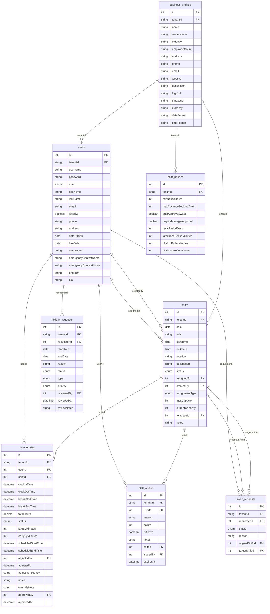

# API to Database Mapping Documentation

This document provides a comprehensive mapping of all API routes to their corresponding database operations and affected tables.

## Authentication & User Management

| Route | Method | Auth | Body Schema | Response Schema | Affected Tables |
|-------|--------|------|-------------|----------------|----------------|
| `/api/users` | GET | owner,staff | - | `User[]` | `users` |
| `/api/users/:id` | GET | owner,staff | - | `User` | `users` |
| `/api/users/:id` | PUT | owner,staff | `InsertUser` | `User` | `users` |
| `/api/users` | POST | owner | `InsertUser` | `User` | `users` |
| `/api/users/:id` | DELETE | owner | - | `{success: boolean}` | `users` |

## Shift Management

| Route | Method | Auth | Body Schema | Response Schema | Affected Tables |
|-------|--------|------|-------------|----------------|----------------|
| `/api/shifts` | GET | owner,staff | - | `Shift[]` | `shifts`, `time_entries` |
| `/api/shifts/:id` | GET | owner,staff | - | `Shift` | `shifts` |
| `/api/shifts` | POST | owner | `InsertShift` | `Shift` | `shifts` |
| `/api/shifts/:id` | PUT | owner | `InsertShift` | `Shift` | `shifts` |
| `/api/shifts/:id` | DELETE | owner | - | `{success: boolean}` | `shifts`, `time_entries` |
| `/api/shifts/:id/claim` | POST | staff | `{userId: number}` | `Shift` | `shifts`, `staff_strikes` |
| `/api/shifts/:id/cancel` | POST | staff | `{userId: number}` | `{success: boolean}` | `shifts`, `staff_strikes` |

## Time Tracking

| Route | Method | Auth | Body Schema | Response Schema | Affected Tables |
|-------|--------|------|-------------|----------------|----------------|
| `/api/time-entries` | GET | owner,staff | - | `TimeEntry[]` | `time_entries`, `shifts`, `users` |
| `/api/time-entries/:id` | GET | owner,staff | - | `TimeEntry` | `time_entries` |
| `/api/time-entries` | POST | staff | `InsertTimeEntry` | `TimeEntry` | `time_entries` |
| `/api/time-entries/:id` | PUT | owner,staff | `InsertTimeEntry` | `TimeEntry` | `time_entries` |
| `/api/time-entries/:id/override` | PUT | owner | `OverrideTimeEntry` | `TimeEntry` | `time_entries` |

## Holiday Management

| Route | Method | Auth | Body Schema | Response Schema | Affected Tables |
|-------|--------|------|-------------|----------------|----------------|
| `/api/holiday-requests` | GET | owner,staff | - | `HolidayRequest[]` | `holiday_requests`, `users` |
| `/api/holiday-requests/:id` | GET | owner,staff | - | `HolidayRequest` | `holiday_requests` |
| `/api/holiday-requests` | POST | staff | `InsertHolidayRequest` | `HolidayRequest` | `holiday_requests`, `holiday_entitlements` |
| `/api/holiday-requests/:id` | PUT | owner | `InsertHolidayRequest` | `HolidayRequest` | `holiday_requests`, `holiday_entitlements` |
| `/api/holiday-entitlements` | GET | owner | - | `HolidayEntitlement[]` | `holiday_entitlements`, `users` |
| `/api/holiday-entitlements/:userId` | PUT | owner | `InsertHolidayEntitlement` | `HolidayEntitlement` | `holiday_entitlements` |

## Shift Swaps

| Route | Method | Auth | Body Schema | Response Schema | Affected Tables |
|-------|--------|------|-------------|----------------|----------------|
| `/api/swap-requests` | GET | owner,staff | - | `SwapRequest[]` | `swap_requests`, `shifts`, `users` |
| `/api/swap-requests/:id` | GET | owner,staff | - | `SwapRequest` | `swap_requests` |
| `/api/swap-requests` | POST | staff | `InsertSwapRequest` | `SwapRequest` | `swap_requests`, `staff_strikes` |
| `/api/swap-requests/:id` | PUT | owner,staff | `InsertSwapRequest` | `SwapRequest` | `swap_requests`, `shifts` |
| `/api/swap-requests/:id/accept` | POST | staff | `{userId: number}` | `SwapRequest` | `swap_requests`, `shifts` |
| `/api/swap-requests/:id/approve` | POST | owner | `{approved: boolean}` | `SwapRequest` | `swap_requests`, `shifts` |

## Strike Management

| Route | Method | Auth | Body Schema | Response Schema | Affected Tables |
|-------|--------|------|-------------|----------------|----------------|
| `/api/staff/strikes` | GET | owner,staff | - | `StaffStrike[]` | `staff_strikes`, `users` |
| `/api/staff/:userId/strikes` | GET | owner,staff | - | `StaffStrike[]` | `staff_strikes` |
| `/api/staff/strikes` | POST | owner | `InsertStaffStrike` | `StaffStrike` | `staff_strikes` |
| `/api/staff/strikes/:id` | PUT | owner | `InsertStaffStrike` | `StaffStrike` | `staff_strikes` |
| `/api/staff/strikes/can-claim/:userId` | GET | staff | - | `{canClaim: boolean}` | `staff_strikes` |

## Business Configuration

| Route | Method | Auth | Body Schema | Response Schema | Affected Tables |
|-------|--------|------|-------------|----------------|----------------|
| `/api/business-profile` | GET | owner,staff | - | `BusinessProfile` | `business_profiles` |
| `/api/business-profile` | PUT | owner | `InsertBusinessProfile` | `BusinessProfile` | `business_profiles`, `users` |
| `/api/job-roles` | GET | owner,staff | - | `JobRole[]` | `job_roles` |
| `/api/job-roles` | POST | owner | `InsertJobRole` | `JobRole` | `job_roles` |
| `/api/job-roles/:id` | PUT | owner | `InsertJobRole` | `JobRole` | `job_roles` |
| `/api/locations` | GET | owner,staff | - | `Location[]` | `locations` |
| `/api/locations` | POST | owner | `InsertLocation` | `Location` | `locations` |
| `/api/locations/:id` | PUT | owner | `InsertLocation` | `Location` | `locations` |

## Policy Management

| Route | Method | Auth | Body Schema | Response Schema | Affected Tables |
|-------|--------|------|-------------|----------------|----------------|
| `/api/shift-policy` | GET | owner,staff | - | `ShiftPolicy` | `shift_policies` |
| `/api/shift-policy` | PUT | owner | `InsertShiftPolicy` | `ShiftPolicy` | `shift_policies` |
| `/api/operating-hours` | GET | owner,staff | - | `OperatingHours[]` | `operating_hours` |
| `/api/operating-hours` | POST | owner | `InsertOperatingHours` | `OperatingHours` | `operating_hours` |
| `/api/operating-hours/:id` | PUT | owner | `InsertOperatingHours` | `OperatingHours` | `operating_hours` |

## Schedule Templates

| Route | Method | Auth | Body Schema | Response Schema | Affected Tables |
|-------|--------|------|-------------|----------------|----------------|
| `/api/schedule-templates` | GET | owner | - | `ScheduleTemplate[]` | `schedule_templates` |
| `/api/schedule-templates` | POST | owner | `InsertScheduleTemplate` | `ScheduleTemplate` | `schedule_templates` |
| `/api/schedule-templates/:id` | PUT | owner | `InsertScheduleTemplate` | `ScheduleTemplate` | `schedule_templates` |
| `/api/schedule-templates/:id/generate` | POST | owner | `{startDate: string, weeks: number}` | `Shift[]` | `schedule_templates`, `shifts` |

## Analytics & Reporting

| Route | Method | Auth | Body Schema | Response Schema | Affected Tables |
|-------|--------|------|-------------|----------------|----------------|
| `/api/analytics/reports` | GET | owner | - | `AnalyticsReport[]` | `analytics_reports` |
| `/api/analytics/metrics` | GET | owner | - | `AnalyticsMetric[]` | `analytics_metrics` |
| `/api/activity-logs` | GET | owner | - | `ActivityLog[]` | `activity_logs` |
| `/api/performance/metrics` | GET | owner,staff | - | `PerformanceMetric[]` | `performance_metrics` |

## Subscription Management

| Route | Method | Auth | Body Schema | Response Schema | Affected Tables |
|-------|--------|------|-------------|----------------|----------------|
| `/api/subscription` | GET | owner | - | `Subscription` | `subscriptions`, `subscription_plans` |
| `/api/subscription` | PUT | owner | `InsertSubscription` | `Subscription` | `subscriptions` |
| `/api/subscription-plans` | GET | owner | - | `SubscriptionPlan[]` | `subscription_plans` |
| `/api/usage-metrics` | GET | owner | - | `UsageMetric[]` | `usage_metrics` |
| `/api/invoices` | GET | owner | - | `Invoice[]` | `invoices` |

## Live Operations Dashboard

| Route | Method | Auth | Body Schema | Response Schema | Affected Tables |
|-------|--------|------|-------------|----------------|----------------|
| `/api/dashboard/strikes-summary` | GET | owner | - | `StrikeSummary` | `staff_strikes`, `users` |
| `/api/dashboard/shift-coverage` | GET | owner | - | `CoverageStats` | `shifts`, `time_entries` |
| `/api/dashboard/live-time-entries` | GET | owner | - | `LiveTimeEntry[]` | `time_entries`, `users`, `shifts` |
| `/api/dashboard/escalations` | GET | owner | - | `Escalation[]` | `swap_requests`, `holiday_requests` |
| `/api/dashboard/pending-requests` | GET | owner | - | `PendingRequest[]` | `holiday_requests`, `swap_requests` |

## Assignments & Opportunities

| Route | Method | Auth | Body Schema | Response Schema | Affected Tables |
|-------|--------|------|-------------|----------------|----------------|
| `/api/assignments` | GET | owner,staff | - | `Assignment[]` | `assignments`, `users` |
| `/api/opportunities` | GET | staff | - | `Opportunity[]` | `shifts` (status='open') |

---

## Entity Relationship Diagram

## Data Flow Summary

### Key Patterns
1. **Tenant Isolation**: All data operations are scoped by `tenantId` for multi-tenancy
2. **Role-Based Access**: Routes filter data based on user role (owner sees all, staff sees own)
3. **Foreign Key Integrity**: All relationships enforced with CASCADE deletes
4. **Audit Trail**: CreatedAt/UpdatedAt timestamps on all entities
5. **Policy-Driven**: Strike system and time tracking governed by configurable policies

### Critical Dependencies
- User authentication drives all tenant and role filtering
- Shift policies control automated strike detection and time tracking rules
- Business profiles provide configuration context for all operations
- Strike points affect shift claiming eligibility for staff users